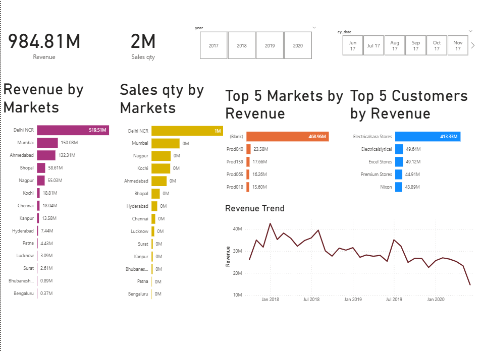
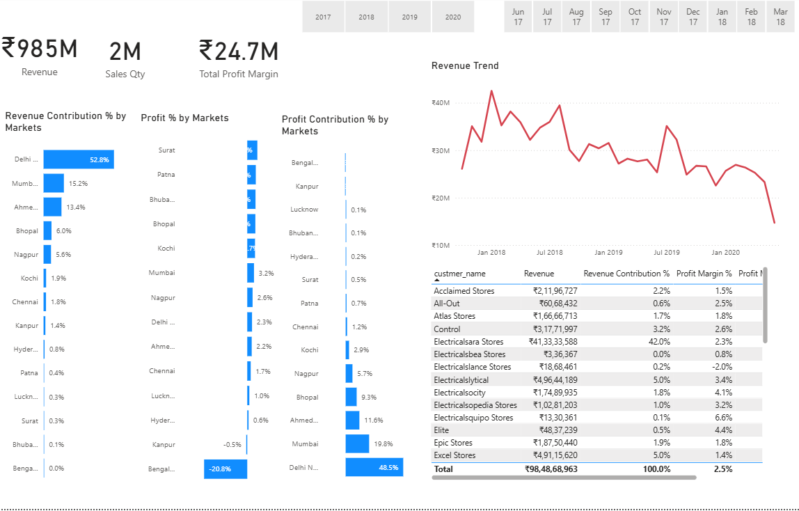
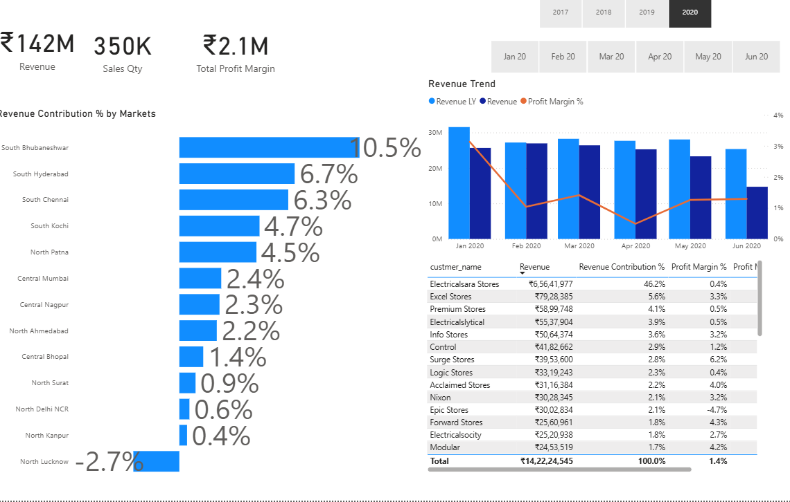

# 📊 Sales, Profit & Performance Insights Dashboard  

This repository contains **interactive dashboards** built using Power BI for analyzing **Sales, Profit, and Performance** across different markets, products, and customers.  

---

## 🔹 Files
- `sales-insights.pbix` → Power BI project file (interactive dashboards)  
- `sales-insights.pdf` → Exported Sales dashboard report  
- `profit-performance-insights.pbix` → Profit & Performance dashboard (interactive)  
- `profit-performance-insights.pdf` → Exported Profit & Performance report  

---

## 🔹 Dashboards  

### 1. Sales Insights  
- 📈 **Revenue Trends** – Year-wise & month-wise analysis  
- 🌍 **Geographic Insights** – Region & city performance  
- 🛍️ **Product Insights** – Top-selling categories  
- 👥 **Customer Insights** – Key customer contribution  

### 2. Profit Analysis  
- 💰 **Profit Contribution % by Market**  
- 📍 **Revenue vs Profit Analysis by Region**  
- 📊 **Top Customers by Profit Margin**  
- ⚡ **Market-wise Profitability Comparison**  

### 3. Performance Insights  
- 📌 **Revenue Contribution by Regions**  
- 📊 **Customer-wise Profit Margin Analysis**  
- 📉 **Revenue & Profit Margin Trends**  
- 🏆 **Top & Bottom Performing Markets**  

---

## 🔹 Tools & Technologies  
- **Power BI Desktop**  
- **Power Query (ETL)**  
- **DAX (Data Analysis Expressions)**  

---

## 🔹 How to Use  
1. Clone or download this repository.  
2. Open `.pbix` files with **Power BI Desktop** for full interactivity.  
3. Use slicers & filters to drill down into insights.  
4. For a quick static view → open `.pdf` files.  

---

## 📷 Dashboard Previews  

### Sales Insights  
  

### Profit Analysis  
  

### Performance Insights  
  

---

✨ This project demonstrates **Business Intelligence & Data Analytics** skills with Power BI, focusing on **Sales, Profit & Performance optimization**.  
